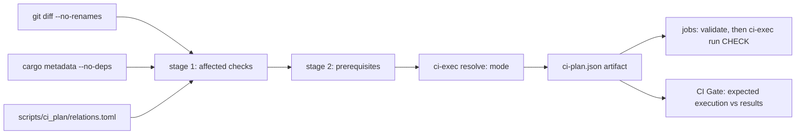

# Continuous integration

Bookclerk’s GitHub Actions workflow (`.github/workflows/ci.yml`) uses a
**dependency-aware planner** so pull requests can skip unrelated work, while
`merge_group` and pushes to `main` always run the full suite.

## Selective CI

`SELECTIVE_CI` in `.github/workflows/ci.yml` selects the execution mode:

| Mode | When | What runs |
| --- | --- | --- |
| `full` | `main` push, `merge_group`, or any fail-closed trigger | Every job and check at full scope |
| `shadow` | `SELECTIVE_CI != "1"` | Every job at full scope; the selective prediction is recorded in the plan summary for audit |
| `selective` | `SELECTIVE_CI == "1"` on a PR | Only the predicted checks, each with its prerequisites |

Full-suite runs on `main` (and `merge_group` once a queue exists) are the
audit for missed selective coverage: a check that fails there but was skipped
on the PR is a planner bug. Until the repository is organization-owned and a
merge queue is required, **`push` to `main` is the full-suite safety net** —
a planner miss can land before `main` CI catches it, so keep planner and
workflow changes small and reviewable.

### Plan → execution contract



- The `plan` job runs `scripts/ci-exec.py resolve`, which writes
  `ci-plan.json` (schema version, run id, a fresh `execution_id`, checked-out
  commit, the prediction and the resolved `execution`) and the job outputs
  used by `if:` gates — both from the same JSON.
- Every downstream job downloads that artifact and runs
  `ci-exec.py validate` first; a missing, stale or foreign artifact fails the
  job.
- Each check is one workflow step running `ci-exec.py run <check>`. The
  executor runs the check's prerequisites (once per execution, in order: builds →
  pinned `workerd` → platform install → guest staging) and then its commands.
  Local reproduction uses the same entry points:

  ```bash
  python3 scripts/ci-plan.py --paths crates/bookclerk-cli/src/main.rs --format summary
  python3 scripts/ci-exec.py resolve --selective 1 --paths crates/bookclerk-cli/src/main.rs
  python3 scripts/ci-exec.py show rust_test --run-id local   # print commands
  python3 scripts/ci-exec.py run rust_test --run-id local    # run them
  ```

  Resolving again mints a new `execution_id` and starts a fresh execution.
  Prerequisite completion from the previous artifact is not reused, even in
  the same temporary directory with the same commit and run id. Checks that
  share one artifact still run each prerequisite only once. `show` prints
  commands and does not record completion.

- `CI Gate` compares every job's result with `execution.jobs`: expected jobs
  must succeed, unexpected jobs must be skipped. Failures, cancellations,
  unexpected skips and unexpected runs all fail the gate. Because the gate
  uses the *execution* (not the prediction), shadow mode's intentional full
  runs pass.
- `scripts/tests/test_ci_contract.py` (PyYAML, hash-pinned in
  `scripts/tests/requirements.txt`) fails when the workflow and planner could
  diverge: unknown or unused outputs, a check with zero or two steps, a job
  the gate does not see, a job that does not validate first, unpinned actions,
  or `continue-on-error`.

## Planner

```bash
python3 scripts/ci-plan.py --base <sha> --head <sha> --format summary
python3 scripts/tests/test_ci_plan.py        # planner + executor scenarios
python3 scripts/tests/test_ci_relations.py   # relations.toml guardrails
python3 scripts/tests/test_ci_contract.py    # workflow contract (needs PyYAML)
```

### Stage 1: affected checks

Each changed path (renames contribute old and new paths) is classified:

| Input | Effect |
| --- | --- |
| Package source (`src/`, `build.rs`, `Cargo.toml`, other package files) | Package is **compiled-affected**; propagates over **normal/build** edges to compiled consumers (optional edges count — no feature resolution) |
| `tests/**`, `benches/**`, `examples/**` in a package | Owner only, by target type: `--tests`, `cargo bench --benches --no-run`, `cargo build --examples` |
| **Dev** edge to a compiled package | Consumer's tests, bench/example builds and doctests; **not** propagated to its production consumers |
| Declared `embed` (e.g. TS/Python SDK runtime into `bookclerk-workerd`) | Package compiled-affected |
| Declared `test_input` / `fixture` | Consumer tests (fixtures skip the owner's compile propagation) |
| Declared `test_guests` executable changed | Launching package's tests re-run (no propagation) |
| `ui/`, `packages/plugin-sdk*/`, ABI scripts | UI, SDK ABI and API-doc checks |
| `docs/**` | Nothing beyond the plan job's always-on lint tests |
| Root `Cargo.toml` / `Cargo.lock`, toolchain, `.cargo/`, workflows, the planner, `fuzz/`, unknown or unclassified paths, planner errors | **Full suite** |

`Cargo.lock` stays a full-suite trigger in this iteration; dependency-update
precision can follow.

### Stage 2: prerequisites

Every selected check lists what a clean runner needs, with a reason:

- `rust_test`: `cargo build -p` for executables its packages' tests launch
  (`test_guests`), plus pinned `workerd` when they spawn through it. Tests run
  with `BOOKCLERK_REQUIRE_TEST_GUESTS=1`, so a missing guest fails instead of
  skipping.
- `e2e`: jail + launcher + the native guests in scope, pinned `workerd`,
  `cargo install-platform --skip-build`, and `cargo stage-plugins --plugin
  <id>…` (or `--optional --examples` for the full installation). Runs
  `bookclerk-plugin-e2e` with `BOOKCLERK_REQUIRE_STAGED_PLUGINS=1`.
- `postgres` `rpc_like`: postgres guest + launcher + jail and pinned `workerd`.

Prerequisites never select suites: building the sqlite guest for host tests
does not select sqlite's own tests or E2E.

### Staged E2E scope

`bookclerk-plugin-e2e` owns the staged-installation suite; the ordinary test
step excludes it (`--exclude bookclerk-plugin-e2e` on the full suite).

- **Full** — a direct source change in a `staged_e2e.full_packages` package
  (dev, manifest, abi, workerd, jail, sandbox, the e2e crate), an inventory
  manifest (`crates/bookclerk-plugins/*/*/plugin.toml`,
  `examples/plugins-*/plugin.toml`), host discovery / registry / install
  preflight, or the full suite.
- **Subsets** — each compiled-affected guest package adds its id; changed
  non-Cargo example guests add theirs; the workerd SDK runtime embed adds
  every workerd-runtime guest; shared host runtime changes add the
  `runtime_smoke` guests (native Rust, workerd TS, workerd Python).
- **Combination** — full wins over subsets, subsets are unioned,
  prerequisites add nothing. Platform guests (`sqlite`, `local`) are always
  installed and checked. An embedded SDK change marks `bookclerk-workerd`
  affected *through the embed*, so it selects the workerd-runtime subset, not
  the full installation; a change under `crates/bookclerk-workerd/src/` is a
  direct source change and selects full.

### Declarations (`scripts/ci_plan/relations.toml`)

The only handwritten graph: relationships `cargo metadata` cannot describe
(embedded assets, cross-package test inputs and fixtures, executables tests
launch, feature-specific test runs, postgres step owners, E2E scope rules,
platform-job membership, release packaging inputs). It does not restate the
workspace dependency graph.

`scripts/tests/test_ci_relations.py` is a **guardrail, not a completeness
guarantee**. It recognizes literal `include_str!` / `include_bytes!` paths,
Rust string literals that resolve to another package or repository path, and
workspace binary names in `tests/`; each must be declared, related through
Cargo, under a full-suite path, or listed in `[[reviewed]]` with a reason.
Computed paths, macro-generated includes and dynamically discovered fixtures
are **not** detected — declare them, or rely on the conservative fallbacks.

## Jobs

| Job | Runs when | Checks |
| --- | --- | --- |
| `plan` | Always | Planner/executor/contract/guardrail tests, DB isolation + docs lints, `resolve`, `ci-plan` artifact |
| `fmt / clippy / test` | Any check below is selected | `ui`, `plugin_sdk_abi`, `python_sdk`, `author_surface`, `fmt`, `clippy`, `clippy_publish`, `api_docs`, `doctest`, `store_free`, `rust_test`, `e2e` — related Rust checks share one compile |
| `release build` | A shipped binary (hosts, helpers, platform guests) is compiled-affected | `affected`: `cargo build --release -p <affected shipped>`; `full` (packaging inputs: `bookclerk-dev`, workerd pins, platform manifests; or full suite): `build-app --release --platform` + helper layout assertions |
| `sandbox + jailed tiers` (3 OS) | sandbox / jail / media / media-worker affected | Clippy + enforcement tests (Windows `--test-threads=1`) |
| `native-behind-workerd gateway` (Windows) | workerd / plugin-sdk affected, or plugin-host `src` | Clippy workerd, sdk `http`, host `--lib`; named-pipe `SOCKET_PROXY` tests |
| `tray` (3 OS) | `bookclerk-tray` affected | Clippy + tests |
| `postgres 16/17/18` | An owning package's unit tests are affected (library, db-guest, postgres guest, plugin-host RPC LIKE) | Only the owners' steps, on every supported major |
| `CI Gate` | Always | Stable required check (see contract above) |

OSV scanning remains a separate workflow/gate. A green OSV job that applies
[`osv-scanner.toml`](../osv-scanner.toml) `IgnoredVulns` means **zero
unignored/actionable** findings, not that ignored advisories have left the
dependency graph. Each ignore must record reachability evidence and an
`ignoreUntil` review date.

The scheduled **SQL-v1 property** job (`.github/workflows/sql-v1-proptest.yml`)
runs a longer `proptest` suite (`PROPTEST_CASES=256`) on `bookclerk-plugin-abi`
and `bookclerk-db-exec`, grammar-aware sqlite admission plus a PostgreSQL 16
differential (normalized `DbValue` / `DbErrorClass`), and coverage-guided
`cargo-fuzz` targets (`sql_parse`, `sql_lower`) with checked-in corpora under
`fuzz/corpus/`. It is `workflow_dispatch` + weekly; PR CI keeps the modest
in-crate case counts, deterministic corpus replay, and the postgres
matrix (binding UTF8 readiness + sqlite/postgres differential).

The scheduled **workerd pin bump** job (`.github/workflows/workerd-pin-bump.yml`)
also compiles `bookclerk-workerd` / `bookclerk-plugin-abi`, so it installs
`capnproto` before `cargo build` when a pin bump is eligible.

## Branch protection / merge queue

Configure repository rulesets / branch protection so the **required** CI check
is **`CI Gate`** (plus the OSV check), **not** every matrix child. Skipped
`release` / `confinement` / `tray` jobs report `skipped`; if those job names are
individually required, merges stay pending forever.

Also enable a merge queue that consumes `merge_group` checks so the full suite
runs on the synthetic merge commit before landing. Merge queues are only
available on **organization-owned** repositories (free for public repos), so
this step waits until the repository lives in an organization. Queue settings:
squash, "only merge non-failing pull requests", build concurrency around 5.
With a queue required, "require branches to be up to date" no longer matters;
the queue tests each entry against current `main` stacked on the entries ahead
of it.

## Dependabot auto-merge

`.github/workflows/dependabot-auto-merge.yml` runs
[`fastify/github-action-merge-dependabot`](https://github.com/fastify/github-action-merge-dependabot)
when a Dependabot PR opens or updates. It approves the PR and turns on GitHub
auto-merge (squash) **for that PR only**. GitHub then merges it, or adds it to
the merge queue when one is required, once `CI Gate` and `PR scan / osv-scan`
pass. Failing PRs stay open for a human.

The repository-level **Allow auto-merge** setting only makes the per-PR
"Enable auto-merge" button and API available; it never merges a PR on its own,
so human PRs merge exactly as before unless someone opts a PR in.

The action must run while checks are still pending: GitHub rejects enabling
auto-merge on a PR that is already mergeable. To retry a Dependabot PR (for
example after adding the secrets), comment `@dependabot rebase`.

Policy knobs live in the workflow's `with:` block:

- `target: any` merges every update type. Tighten to `minor` or `patch` to
  leave larger bumps for manual review.
- `exclude: 'crate-a,crate-b'` skips auto-merge for PRs touching those
  packages.

### Setup

1. **Settings → General → Pull Requests:** enable **Allow auto-merge**.
2. Create a GitHub App (owned by the organization once the repo is
   transferred; an App owned by a user can be transferred later) with
   repository permissions **Contents: read and write** and **Pull requests:
   read and write**, no webhook, and install it on this repository only.
3. Add two **Dependabot** secrets (Settings → Secrets and variables →
   Dependabot). Dependabot-triggered runs do not receive Actions secrets:
   - `DEPENDABOT_MERGE_APP_CLIENT_ID`: the App's client ID.
   - `DEPENDABOT_MERGE_APP_KEY`: a private key generated for the App.

The App token matters: merges and queue entries attributed to `GITHUB_TOKEN`
do not start new workflow runs, so `push` CI on `main`, the OSV SARIF upload,
and `merge_group` checks would be skipped. The App can also approve PRs without
the "Allow GitHub Actions to create and approve pull requests" setting.

### Before the merge queue exists

While the repository is still owned by a user, `Protect Main` keeps "require
branches to be up to date" on. Auto-merge then waits on a Dependabot PR that
has fallen behind `main` until it is rebased. Either:

- turn that option off in the `Protect Main` required-status-checks rule, so
  green Dependabot PRs merge as soon as their checks pass (Dependabot rebases
  PRs that actually conflict, and `push` CI on `main` is the safety net). This
  also relaxes the rule for human PRs until the queue replaces it; or
- leave it on and comment `@dependabot rebase` on PRs that fall behind.

## Expected PR feedback (when `SELECTIVE_CI=1`)

| Change | Jobs after `plan` | Notes |
| --- | --- | --- |
| `docs/**` only | none | `CI Gate` passes with every job skipped |
| `ui/**` only | `fmt / clippy / test` (UI + UI API docs) | no Rust toolchain checks |
| `crates/bookclerk-cli/src/**` | check (`-p bookclerk-cli --tests`), release (`bookclerk-cli`) | no postgres, no E2E |
| `crates/bookclerk-plugin-host/src/**` | check (host + dependents, runtime-smoke E2E), release (hosts), windows gateway, postgres (`rpc_like` only) | no sandbox matrix |
| One optional guest (e.g. Libro) | check (guest tests, E2E `libro` only) | other storefronts are neither built nor staged |
| `packages/plugin-sdk/embed/**` | check (workerd tests, workerd-runtime E2E subset, SDK ABI), release (launcher), windows gateway | not the full installation |

For `merge_group` / `main`, `--force-full` runs every job and check.
